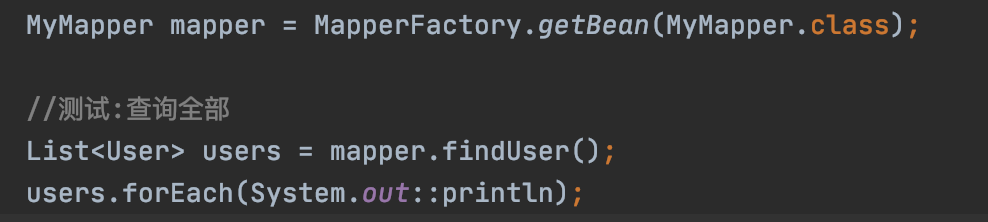

<h1>模拟MyBatis的注解功能写的案例代码</h1>

<h2>启动流程</h2>

1. 在db.properties中添加对应的mysql的驱动,账号,密码,数据库url,建对应的表
2. 修改pom的mysql-connector-java(因为我本地是mysql8,使用5.7可以修改成5)
3. 启动test中的demo即可

<h2>大致用到的东西</h2>

<ol>
<li>jdbc</li>
<li>动态代理</li>
<li>反射</li>
<li>注解的定义</li>
<li>连接池</li>
</ol>

<h2>代码执行流程</h2>

* ①jdk自带动态代理生成Mapper接口的代理类,全部逻辑都实现在MapperHandler类
* ②通过反射获取Method中的@Select,@Insert的信息
* ③通过正则得到  <b>#{}</b> 的占位符, 将方法的参数名和sql中的占位符做关联,生成ParseResult实例,这个实例包含全部的占位符信息和具体值,并讲占位符都替换成统一的?号
* ④通过连接池获取conn实例,调用jdbc的preparedStatement,将含有?号的sql进行预编译
* ⑤根据ParseResult中的信息,给preparedStatement填充信息,然后执行sql(比如Insert就需要使用自增)
* ⑥返回的ResultSet结果交给转换层:通过反射得到函数的返回值泛型,ResultSet转为对应的DO对象

<h3>案例截图</h3>

<h4>mapper定义<h4>

<h4>查询+查询结果<h4>

<h4>插入+插入结果(支持 #{xx} 的形式)</h4>

